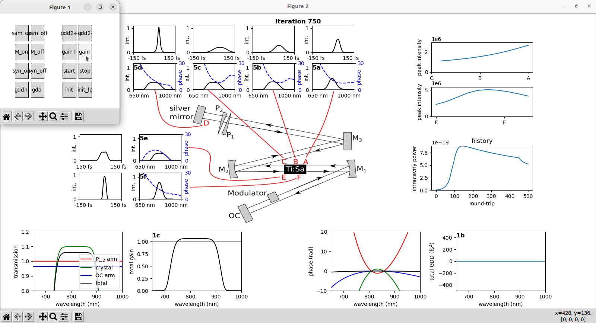

# Py:Sa

A simple and educational open-source implementation of an interactive 1D model for a modelocked femtosecond Ti:Sa oscillator in Python.

Follows M. V. Tognetti, M. N. Miranda, and H. M. Crespo, "*Dispersion-managed mode-locking dynamics in a Ti: sapphire laser*", Physical Review A **74**, 033809 (2006) [10.1103/PhysRevA.74.033809](https://doi.org/10.1103/PhysRevA.74.033809).

Dependencies: only numpy, scipy and matplotlib.

Only tested on Ubuntu Linux. It uses the multiprocessing module for plotting and might need changes to run on Windows.

Screenshot:

